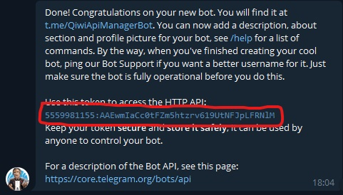
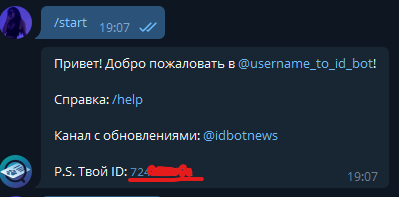
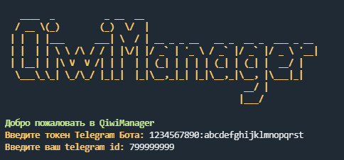

<h1 align="center"><b>QiwiManager</b></h1>

---
## **Donate**

    BTC - 13z1TmenhAbyznbMKunehhtGqUUAUMxdCc
    ETH/USDT - 0x181ce11070f3eea1eb53c7cea53e52d081056658
    BANK - 4890 4947 7158 8654

---

## **Простое управление API токенами QIWI через телеграм🚸**

---
# **Downloads**
### Скачайте последнйи [release](https://github.com/6x00/QiwiManager/releases)
### Установите req.txt командой:
    WIN:
        pip install -r req.txt
    LINUX:
        pip3 install -r req.txt
### Перейдите в котолог main
    cd main

### Создайте бота с помощью [@BotFather](https://t.me/BotFather)
### После создания вам выдаст токен

### Далее в боте [@username_to_id_bot](https://t.me/username_to_id_bot) скопируйте свой ID телеграма

### Скопируйте всё

### Запустите файл setup.py
    WIN:
        python setup.py
    LINUX:
        python3 setup.py

### Введите все данный

### После успешнйо установки передйте в бота и следуйте инструкции в нём
---
# О программе

### Она нацеленная на управление множеством Qiwi API токенами дабы упростить использование сервиса.
### Есть возможность подлкючить proxy сервера формата HTTP для лучшей работы (Можно с VPN если нет proxy)

